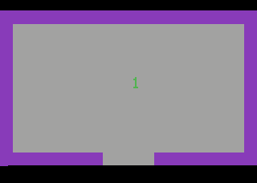

# mi — Labyrinth navigation experiments

`mi` is a buildable 4 KiB Atari 2600 ROM written in DASM assembly. It also
provides a reproducible path from assembly source to Stella emulation, with
scripted controller input, state telemetry, keyframes, and visual experiment
records.

The canonical source is [src/adventure.asm](src/adventure.asm). Generated ROMs
and experiment outputs live under `build/` and are not committed.

## What a fresh clone can do

With DASM, a clone can:

- build `src/adventure.asm` into `build/adventure.bin`;
- open the ROM in a normal installed copy of Stella;
- run a screenshot-based smoke test; and
- inspect the preserved dragon-loss trajectory evidence in
  [validation/dragon-loss-trajectory.gif](validation/dragon-loss-trajectory.gif).

With the companion Stella fork described below, it can additionally replay
timed controller traces, collect frame-by-frame state telemetry, create
keyframe GIFs, and make a scenario pass or fail from an emulated RAM predicate.

## Quick start: build and play

Install DASM and Stella. On Debian or Ubuntu:

```sh
sudo apt-get install dasm stella
```

Build the ROM:

```sh
git clone https://github.com/intelliputer/mi.git
cd mi
make
```

The resulting headerless ROM is `build/adventure.bin`. Launch it with:

```sh
make run
```

In Stella, use the arrow keys to move, Space for fire, F1 for Select, F2 for
Reset, and Escape to leave game mode.

If DASM or Stella is elsewhere, override the commands:

```sh
make DASM=/path/to/dasm
make run STELLA=/path/to/stella
```

## Basic validation

```sh
make validate
```

This rebuilds the ROM, runs Stella for 30 emulated frames with dummy audio, and
requires a non-empty PNG in `build/validation/`. It is a smoke test: it proves
the ROM was built and rendered, but does not establish gameplay behavior. A
Stella run still needs access to a graphical SDL session; dummy audio avoids a
dependency on the host’s active audio output.

## Deterministic agent experiments

The deterministic runner is maintained in the companion fork
[`intelliputer/stella`](https://github.com/intelliputer/stella). Clone it next
to this repository—the Makefile defaults to `../stella/stella`:

```sh
cd ..
git clone https://github.com/intelliputer/stella.git
cd stella
./configure
make -j"$(nproc)"
cd ../mi
```

The local fork requires the SDL 3 development package to build (for example,
`libsdl3-dev` on Debian/Ubuntu). Its local additions are documented in the
[Stella fork notes](https://github.com/intelliputer/stella/blob/master/FORK-NOTES.md).

The fork adds these non-interactive options:

- `-inputscript FILE` — replay frame-indexed controller events from JSON;
- `-snapshotframes N` — save a snapshot and quit at a fixed frame budget;
- `-assertmemory ADDRESS=VALUE` — return failure unless an emulated RAM byte
  has the expected hexadecimal value at the final frame;
- `-telemetry FILE` — emit per-frame JSON Lines state data; and
- `-keyframeinterval N` — save numbered PNG keyframes at a fixed interval.

## Dragon-loss reference scenario

`validation/dragon-loss.json` is a recorded policy that begins a game, follows
an exploratory route, and reaches the observed dragon-loss outcome. It is
useful as a reproducible negative example; it is not a yellow-key solution.

```sh
make validate-dragon-loss
```

The target intentionally checks the old yellow-key predicate, `RAM[$9D] ==
$BF`, at frame 1,350. It currently fails because the player is not carrying the
key. That failure is expected and prevents a bad policy from being reported as
success.

The preserved visual evidence is:



See [validation/README.md](validation/README.md) for its provenance.

## Record and inspect a run

```sh
make record-dragon-loss
```

This command intentionally returns non-zero for the known failing policy, but
still writes a complete replay bundle at `build/experiments/dragon-loss/`:

```text
actions.json       exact replayable input trace
telemetry.jsonl    room, player coordinates, and carried-object state per frame
keyframes/         PNG frames captured every 10 emulation frames
trajectory.gif     looping visual trajectory, 15 centiseconds per frame
manifest.json      ROM SHA-256, run settings, and final exit status
```

To run it interactively from a shell while retaining the expected failure:

```sh
make record-dragon-loss || true
xdg-open build/experiments/dragon-loss/trajectory.gif
```

Tune the visual density or playback speed without changing source:

```sh
make record-dragon-loss KEYFRAME_INTERVAL=5 GIF_DELAY=10 || true
```

`KEYFRAME_INTERVAL` defaults to `10`. `GIF_DELAY` is centiseconds per frame
and defaults to `15` (about 6.7 fps). More keyframes make a larger GIF.

## Extending the experiments

A new agent policy can start by copying `validation/dragon-loss.json`, changing
the timed Stella input events, and adding a target with a meaningful outcome
predicate. For this Adventure ROM, useful observed RAM locations are:

| Address | Meaning |
| --- | --- |
| `$8A` | Current room |
| `$8B`, `$8C` | Player X and Y coordinates |
| `$9D` | Carried object (`$A2` means none; `$BF` is the Game 1 yellow key) |

The gameplay goal remains open: discover a safe policy that reaches and picks
up the yellow key, then add it as a separate passing scenario. Keep the
dragon-loss trace as a regression case, so changes to the assembly source or
navigation logic remain observable.

For implementation history, design rationale, and limitations, read
[Stella validation and navigation notes](docs/STELLA-VALIDATION-AND-NAVIGATION.md).

## Clean generated output

```sh
make clean
```

This removes only `build/`; it does not remove the tracked validation evidence.
